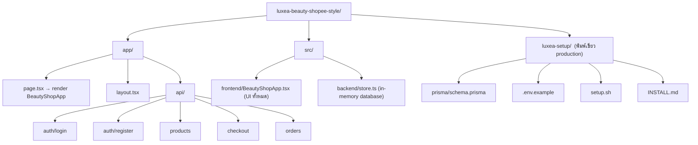
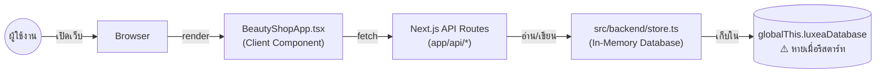
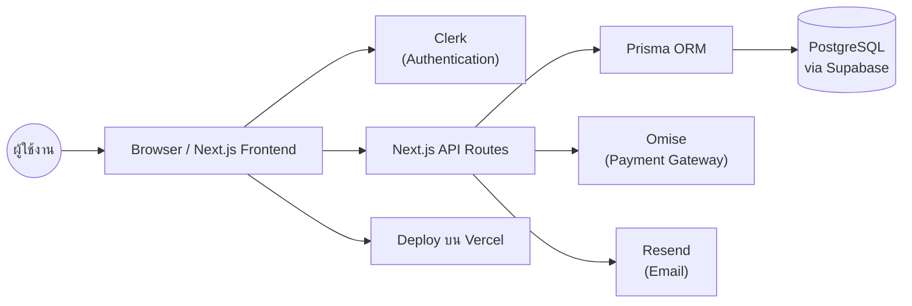
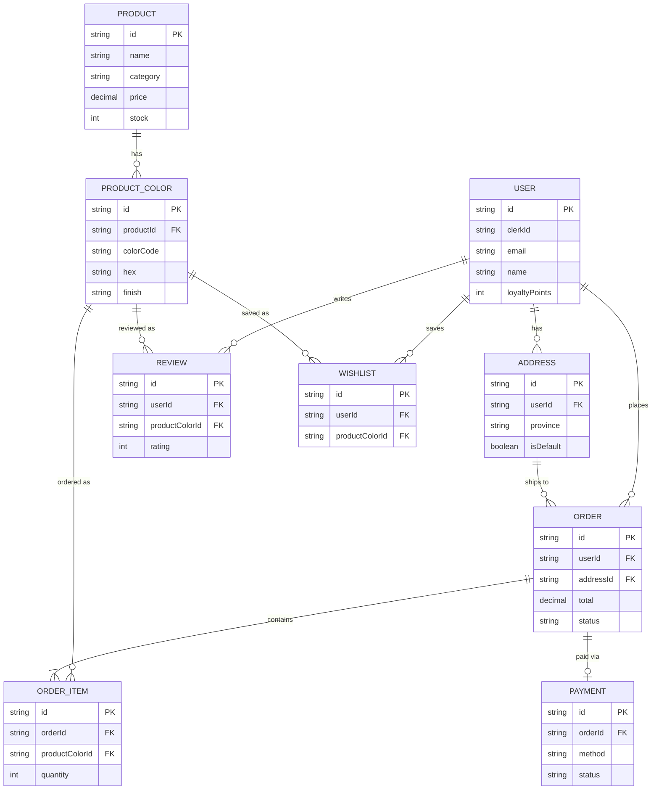
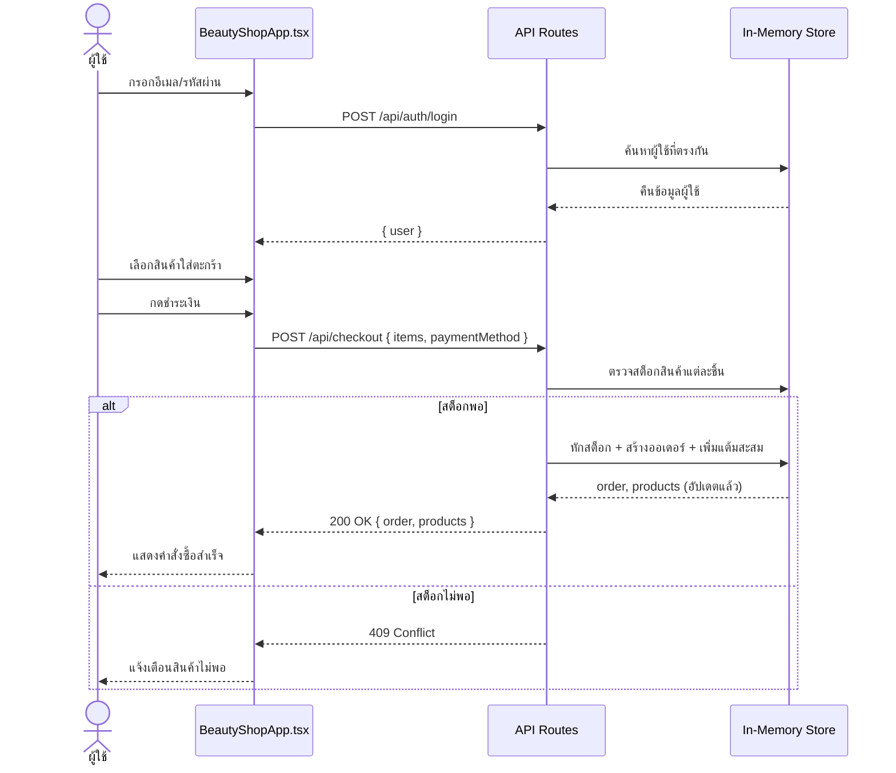

# 💄 LUXÉA Beauty — Shopee-style Beauty Marketplace

แอปพลิเคชันร้านค้าออนไลน์เครื่องสำอาง สไตล์ Shopee สร้างด้วย **Next.js App Router** พร้อมระบบสมัครสมาชิก/ล็อกอิน ตะกร้าสินค้า เช็คเอาต์ ระบบแต้มสะสม และหน้าแอดมินจัดการสต็อก

---
// roles.ts
// ตารางกลุ่มสมาชิก / ตำแหน่งในระบบ LUXÉA Beauty
// ช่อง "หน้าที่" เว้นว่างไว้ให้กรอกเพิ่มเติมเอง

export type Role = {
  id: string;            // รหัสกลุ่ม
  groupName: string;     // ชื่อกลุ่มสมาชิก
  roleField: string;     // ค่าที่เก็บใน field role/tier ของระบบ
  accessLevel: string;   // สิทธิ์การเข้าถึงระบบ
  duty: string;          // 👈 หน้าที่ความรับผิดชอบ (เว้นว่างไว้ให้กรอกเอง)
};

export const roles: Role[] = [
  {
    id: "member",
    groupName: "ลูกค้าทั่วไป",
    roleField: 'role: "customer", tier: "Member"',
    accessLevel: "ดูสินค้า, สั่งซื้อ, ดูประวัติออเดอร์ตัวเอง",
    duty: "", // <-- กรอกหน้าที่ตรงนี้
  },
  {
    id: "vip",
    groupName: "ลูกค้า VIP",
    roleField: 'role: "customer", tier: "VIP"',
    accessLevel: "เหมือน Member (แต้มสะสมครบ 1,000 อัปเกรดอัตโนมัติ)",
    duty: "", // <-- กรอกหน้าที่ตรงนี้
  },
  {
    id: "admin",
    groupName: "แอดมิน",
    roleField: 'role: "admin"',
    accessLevel: "ดูสินค้า, สั่งซื้อ, แก้ไขราคา/สต็อกสินค้า",
    duty: "", // <-- กรอกหน้าที่ตรงนี้
  },
];
---

## ✨ ฟีเจอร์หลัก

- 🔐 **สมัครสมาชิก / เข้าสู่ระบบ** — เก็บบัญชีผู้ใช้พร้อมระดับสมาชิก (Member / VIP)
- 🛍️ **หน้าร้านสินค้า** — ค้นหา กรองตามหมวดหมู่ ดูเรตติ้งสินค้า
- 🛒 **ตะกร้า & เช็คเอาต์** — เลือกวิธีชำระเงิน (บัตรเครดิต / โอนธนาคาร / เก็บเงินปลายทาง)
- 🎁 **ระบบแต้มสะสม** — ได้แต้มจากยอดซื้อ สะสมครบ 1,000 แต้มอัปเกรดเป็น VIP อัตโนมัติ
- 📦 **ประวัติคำสั่งซื้อ** — ดูสถานะออเดอร์ของตัวเอง
- 🛠️ **หน้าแอดมิน** — ปรับราคาสินค้าและจำนวนสต็อกได้แบบเรียลไทม์

---

## 🧱 สถานะปัจจุบันของโปรเจกต์

โปรเจกต์นี้มี **2 ชั้น** ที่ควรเข้าใจแยกกันให้ชัดเจน:

| ชั้น | สถานะ | รายละเอียด |
|------|-------|-------------|
| **แอปที่รันได้จริงตอนนี้** (`app/`, `src/`) | ✅ ใช้งานได้ทันที | ใช้ **in-memory store** (`src/backend/store.ts`) เก็บข้อมูลไว้ใน RAM ของเซิร์ฟเวอร์ ไม่ต้องต่อฐานข้อมูลใดๆ เหมาะสำหรับเดโม/พัฒนา UI |
| **พิมพ์เขียวสำหรับ Production** (`luxea-setup/`) | 🧩 ยังไม่เชื่อมกับโค้ดจริง | มี `schema.prisma`, `.env.example`, `setup.sh` และ `INSTALL.md` ไว้เป็นแผนสำหรับต่อ PostgreSQL + Clerk (auth) + Omise (payment) + Resend (email) ในอนาคต |

> ⚠️ ข้อมูลใน in-memory store จะ**หายทุกครั้งที่รีสตาร์ทเซิร์ฟเวอร์** เพราะยังไม่ได้ต่อฐานข้อมูลจริง

---

## 🗂️ โครงสร้างโปรเจกต์



---

## 🏗️ สถาปัตยกรรมการทำงาน (ปัจจุบัน)



---

## 🔮 สถาปัตยกรรมที่วางแผนไว้ (Production)



---

## 🧬 แผนภาพฐานข้อมูล (จาก `luxea-setup/prisma/schema.prisma`)



> หมายเหตุ: สคีมานี้เป็นแบบละเอียด (มีสี/เฉดสินค้า, ที่อยู่จัดส่ง, รีวิว, วิชลิสต์) ในขณะที่ in-memory store ที่ใช้งานจริงตอนนี้เป็นเวอร์ชันย่อกว่า (ไม่มี Address/Review/Wishlist)

---

## 🔄 ลำดับการทำงาน: ล็อกอิน → เพิ่มตะกร้า → เช็คเอาต์



---

## 📡 API Endpoints

| Method | Endpoint | คำอธิบาย |
|--------|----------|----------|
| `POST` | `/api/auth/register` | สมัครสมาชิกใหม่ |
| `POST` | `/api/auth/login` | เข้าสู่ระบบ |
| `GET` | `/api/products` | ดึงรายการสินค้าทั้งหมด |
| `PATCH` | `/api/products` | แก้ไขราคา/สต็อกสินค้า (ใช้ในหน้าแอดมิน) |
| `POST` | `/api/checkout` | สร้างคำสั่งซื้อ ตัดสต็อก และเพิ่มแต้มสะสม |
| `GET` | `/api/orders?userId=...` | ดึงประวัติคำสั่งซื้อของผู้ใช้ |

---

## 🚀 เริ่มต้นใช้งาน (โหมดเดโม — ไม่ต้องมีฐานข้อมูล)

```bash
npm install
npm run dev
```

เปิดเบราว์เซอร์ไปที่ [http://localhost:3000](http://localhost:3000)

**บัญชีแอดมินสำหรับทดสอบ:**
- อีเมล: `admin@luxea.test`
- รหัสผ่าน: `admin123`

---

## 🏭 อัปเกรดสู่ Production

หากต้องการต่อฐานข้อมูลจริงและระบบยืนยันตัวตน/ชำระเงิน ให้ทำตาม `luxea-setup/INSTALL.md` ซึ่งจะพาไปติดตั้ง:

1. **PostgreSQL** ผ่าน Prisma (`luxea-setup/prisma/schema.prisma`)
2. **Clerk** สำหรับระบบสมาชิก
3. **Omise** สำหรับรับชำระเงิน
4. **Resend** สำหรับส่งอีเมล
5. **Vercel** สำหรับดีพลอย

> การเชื่อมส่วนนี้เข้ากับโค้ดที่มีอยู่ (`app/api/*`, `src/backend/store.ts`) ยังต้องเขียนเพิ่ม เนื่องจากตอนนี้ทั้งสองส่วนยังแยกกันอยู่

---

## 🛠️ Tech Stack

- **Framework:** Next.js 16 (App Router)
- **UI:** React 19 + Tailwind CSS 4
- **Language:** TypeScript
- **Data (ปัจจุบัน):** In-memory store
- **Data (แผนอนาคต):** PostgreSQL + Prisma ORM
